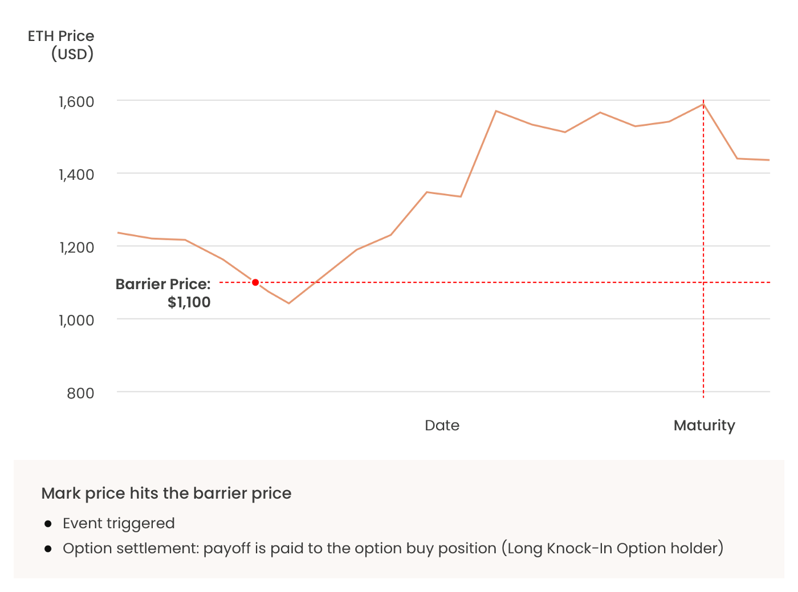
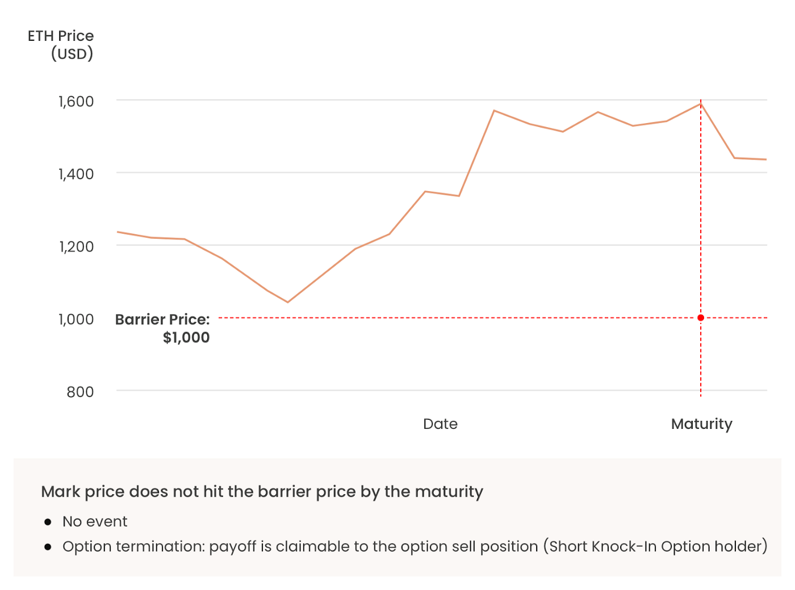
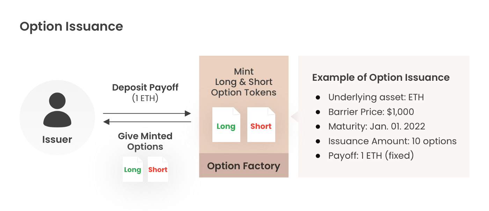
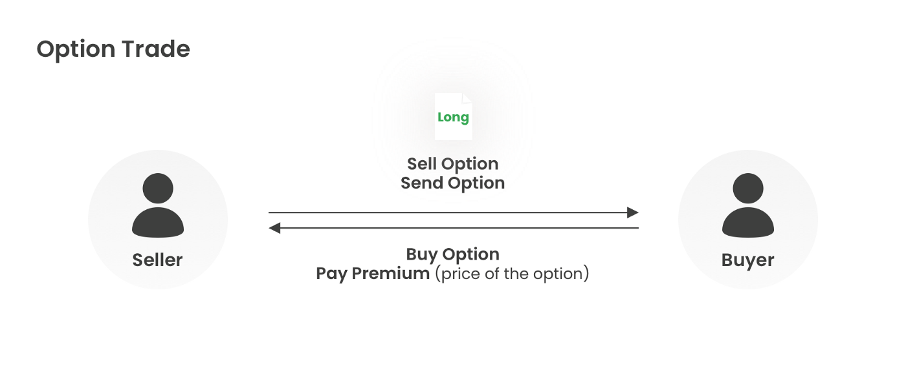
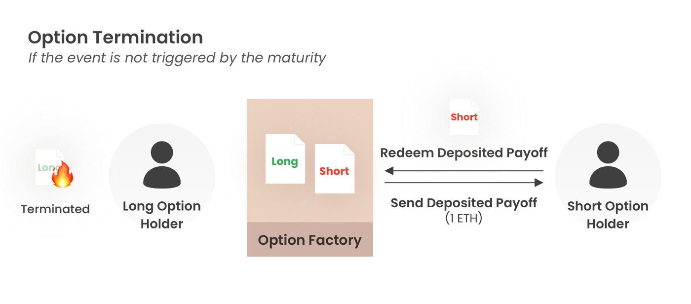
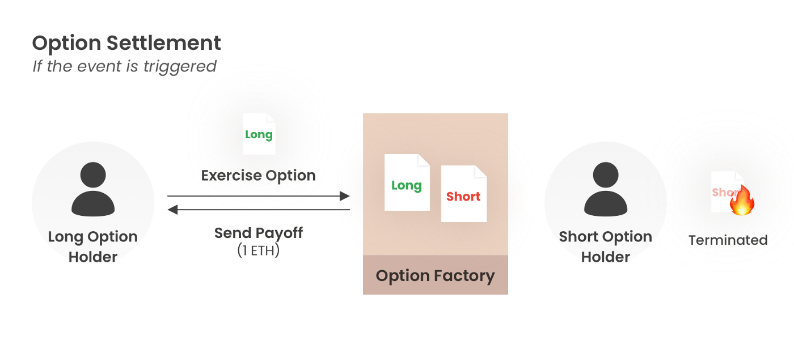

# Liquidation Protector : Onchain Knock-In Option Protocol

## Links
1. [Introduction Deck](https://docs.google.com/presentation/d/1P7nlzPYJrjCPuKpMasZLGXPbLBByhtVsbhr51vgkQi4)
2. [Video Demo](https://www.youtube.com/watch?v=pIIS83bnaxg)
3. [Live site](http://liquidation-protector.s3-website-us-east-1.amazonaws.com/)

## Introduction

### Background
* From 2021, high leveraged investment — such as CEX(Centralized Exchange) futures, DeFi futures & lending — has been showing high volume and leverage.
* High leverage causes a lot of liquidation in a bear market, and investors suffer from losses. A considerable amount of dollars is liquidated every day. However, the instrument for hedging the liquidation risk is not enough.
* Through the KI(Knock-In) option, we design a market where investors can handle the risks of various liquidation events.

### Product Summary
* KI Option is an option in which the Long Option holder receives a fixed amount(payoff) when the mark price of a specific underlying asset enters the barrier price.
* The Short Option holder expects that the event will not be triggered. The Short Option holder can claim the deposited payoff if the event is not triggered by the time of its maturity.
* ‘Option Issuer’ issues ‘Long KI Option’ & ‘Short KI Option’ tokens at once.
    - Payoff must be deposited to issue the options.
    - The issuer holds both Long Option tokens & Short Option tokens right after the issuance and has no position.
    - By selling Long Option tokens & Short Option tokens, the issuer takes option premium and open position.
* At the maturity without the event, the option is terminated, and the deposited payoff is claimable for the Short Option holder.
* The option event is triggered if the mark price crosses the barrier price before maturity. And the deposited payoff is paid to the Long Option holder.

  
[Example of an event trigger and settlement of an option]

  
[Example of termination of an option]

### Market Needs
* Long KI Option holder (= Buy position of a KI Option, Liquidation Protector):
    - Investors who want to hedge their liquidation risk. Primarily futures or collateral-based lending users.
    - Investors want to prepare for an event in which major market players are liquidated.
* Short KI Option holder (= Sell position of a KI Option, Liquidation Protector):
    - Investors who do not expect a particular event to occur.
* Futures CEX/DEX, Collateral-based DeFi:
    - Prevent investors from losing all investment capital by using the options as insurance.
    - They seek sales commissions by selling the option on their platforms.
    - In excessive market volatility, collateral impairment or default risk can be reduced.

## Mechanism
### Option Issuance
* First, the option issuer issues Long KI Option Token & Short KI Option Token. Then, set parameters for the options.
* Parameters
    - Issuing Options: Long KI Option Token & Short KI Option Token
    - Underlying Asset: Set the underlying asset. (e.g., ETH)
    - Barrier Price: Specify the price level to trigger the event.
    - Event: Set mark price and barrier price.
    - Maturity: Date of termination of the option.
    - Payoff: Payoff is fixed at 1 underlying asset. The payoff should be deposited at issuance. (e.g., Payoff = 1 ETH)

  

### Option Trade
* Options are ERC20. Buy/sell positions can be traded on OTC.
    - Due to frequent maturities and various products, it would like to be traded in OTC (P2P) rather than AMM.
* If investors want to close their open positions, they can sellout options in their addresses or offset their positions by buying opposite positions.
(e.g., holding the same amount of Long options and Short options with the same barrier price & maturity, the open position is zero.)
* The quotation in this platform shows the parameters of the KI Option, the model price, and the quote price offered by the seller.

  

### Option Termination
* At the maturity without the event, the option is terminated, and the deposited payoff is claimable for the Short Option holder.

  

### Option Settlement
* The option event is triggered if the mark price crosses the barrier price before maturity. And the deposited payoff is paid to the Long Option holder.

  

## Conclusion
* Leveraging has been common knowledge as crypto derivatives and DeFi markets grow. There was a deleverage in the recent bear market, and we’ve witnessed many liquidation cases. It led to default risk with bigger market loss, and it caused a significant decline in the overall market.
* Therefore, we strongly believe there is a greater market need for liquidation protection instruments and trading these instruments. Not only the liquidation protector will manage individual investors, but also the systematic risk of the market.
* The leverage position of liquidation is path-dependent. Thus, we choose the KI Option and propose the KI Option Protocol runs with minimum functions.
    - The MVP model does not clear the issue of liquidity, a common issue in the options market. Yet, the team will find a solution through further research. Fortunately, various problem-solving methods are proposed and ready to be proven in the market.
* When our KI Option works as liquidity protection appropriately, it can be integrated with futures and lending protocols as collateral or insurance.

## Appendix - Glossary
* Mark Price: Base price of underlying asset imported from oracle.
* Barrier Price: Price level to trigger events.
* Event: Event is triggered when Mark Price crosses Strike Price.
* Maturity: The date the option is terminated if there is no event trigger.
* Premium: The amount the buyer pays the seller when an option is sold.
* Long KI Option Token: Holding the Long KI Option Token means the holder has (+) or buy position of the KI Option.
* Short KI Option Token: Holding the Short KI Option Token means the holder has (-) or sell position of the KI Option.
* Option Issuance: Minting both Long & Short KI Option Tokens at once by depositing payoff.
* Payoff: Deposited token to be paid to Long Option Holder or Short Option Holder depending on the event or the maturity.
* Settlement: If the event is triggered, the payoff is delivered to the Long KI Option Holder, and the Long & Short KI Options are terminated.

## File structures
* Knock-in Option parts  
  - contracts/KIOptionFactory.sol
  - contracts/KIOptionController.sol
  - contracts/token/KIOption.sol
  - contracts/token/KIMinusOption.sol
  - contracts/token/KIPlusOption.sol
* MakerDAOMock parts:  
A mock of MakerDAO, a project that takes Ethereum as collateral and issues DAI, a stable coin linked to the dollar.  
  - contracts/MakerDaoController.sol
  - contracts/MakerDaoVault.sol
* TheGraph subgraphs
  - graph/ki-oracle
  - graph/option
  - graph/optionmarket
  - graph/vault
* hardhat tests & tasks
  - tasks/
  - test/  

* bot parts(Execution Bot, Redeem Bot, Liquidation Bot:  

(Execution Bot)  
1. when Option Factory contract and Oracle contract emit some events, the Graph nodes listen the events and handle the event data to store.
2. Executor bot periodically polls the information that returns about oracle market price of ETH and option creation data. Then stores them in a redis database.
3. Executor processes periodically polls the redis database to get a subset of options. Processes loop through the options to decide if they are executable according to comparison between a barrier price and the market price of ETH. If it fulfills the condition, the code immediately sends a transaction to execute them.  

(Liquidation Bot)
1. when MakerDAO Vault contract and Oracle contract emit some events, the Graph nodes listen the events and handle the event data to store.
2. Liquidation bot periodically polls the information that returns about oracle market price of ETH and vault collateral data. Then stores them in a redis database.
3. Liquidator processes periodically polls the redis database to get a subset of vaults. Processes loop through the vaults to decide if they are liquidatable according to comparison between a liquidation price and the market price of ETH. If it fulfills the condition, the code immediately sends a transaction to liquidate them.  

(Redeem Bot)  
A bot that automatically adds the payoff received from executed options to the MakerDAO collateral for option buyers.
  - execution_bot/
  - liquidation_bot/  